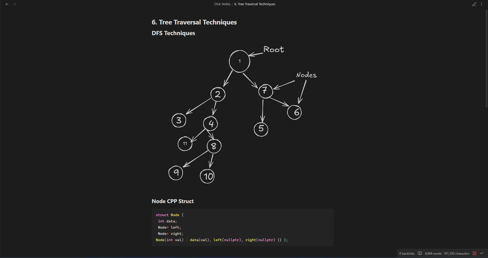
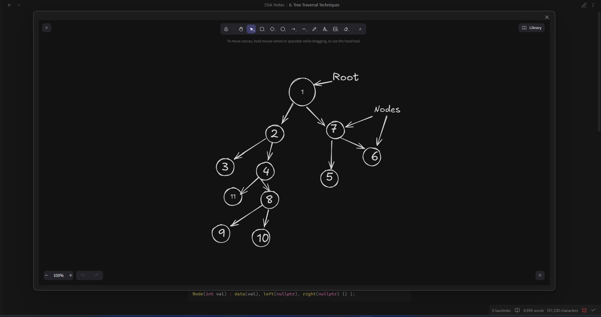
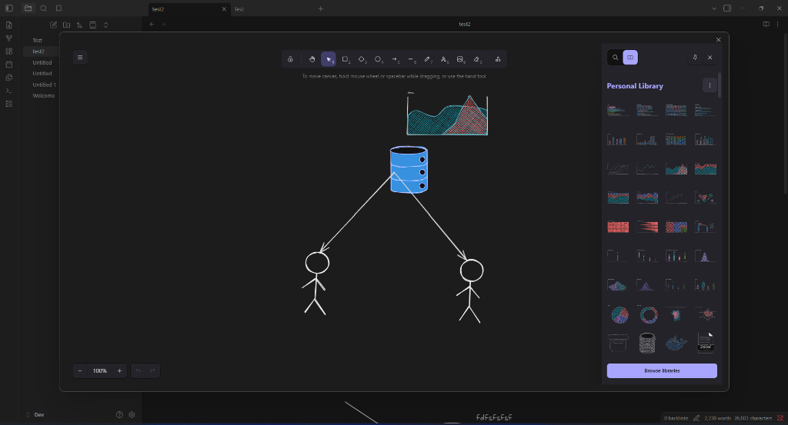
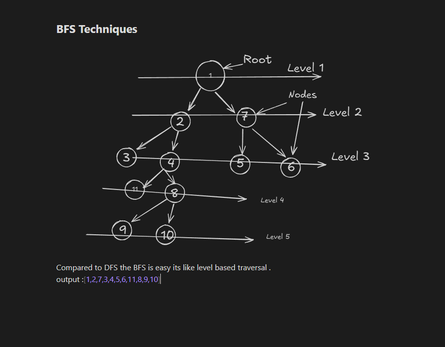
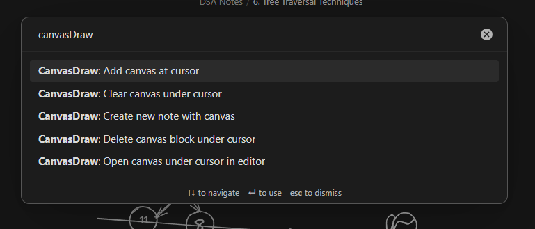
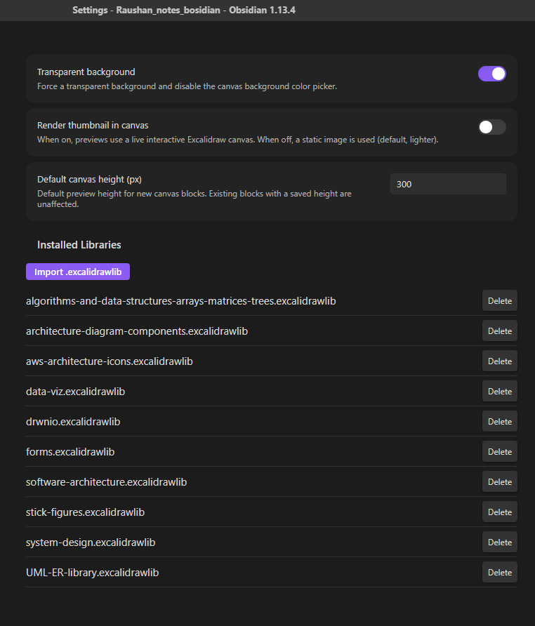
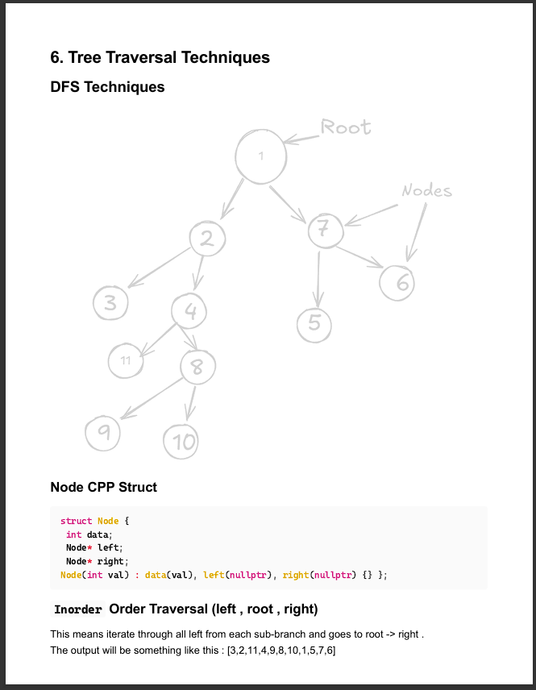

<div align="center">

# 🎨 CanvasDraw

**Seamless, lightweight, and powerful Excalidraw integration for Obsidian.**

Embed interactive drawings, system architecture diagrams, mind maps, and sketches directly inside your markdown notes with zero friction.

[](https://obsidian.md)
[](https://www.typescriptlang.org/)
[](https://excalidraw.com)
[](https://opensource.org/licenses/MIT)

<br/>



</div>

---

## ✨ Features at a Glance

- 📝 **Native Markdown Code Blocks** — Diagrams stored directly inside ` ```excalidraw ` code blocks in your note files.
- ⚡ **Instant Click-to-Edit Modal** — Click any drawing thumbnail to open the full-screen Excalidraw editor.
- 🖼️ **Image & Asset Support** — Paste or drag images into your drawing; assets are saved automatically in your vault's `content/` folder.
- 📚 **Library Panel & Custom Imports** — Import `.excalidrawlib` files and browse pre-built elements from the Library sidebar.
- 🔍 **Interactive Canvas & Zoom Controls** — Hover to reveal `+` / `−` zoom buttons and a corner resize handle.
- 💾 **Per-Block Layout Persistence** — Canvas height and zoom level saved inside each block's JSON, preserving your exact viewport.
- 🌗 **Automatic Theme Sync** — Adapts to Obsidian's Light and Dark themes seamlessly.
- 🪟 **Transparent Background Mode** — Render diagrams with a transparent background for seamless note blending.
- ⌨️ **Command Palette Integration** — Fast commands to insert, edit, clear, and delete drawing blocks.

---

<div align="center">

[](https://community.obsidian.md/plugins/canvas-draw)

</div>

---

## 📸 Feature Tour

### 1. Inline Previews in Reading View
Your drawings render as crisp inline previews inside your notes. Click on any canvas to open the full editor modal instantly.


---

### 2. Full-Featured Drawing Editor
Open any canvas into the complete Excalidraw workspace — shapes, arrows, colors, roughness settings, and handwriting fonts, all in a clean full-screen modal.



---

### 3. Library Panel & Element Browser
Click **Library** in the editor toolbar to open the side panel. Browse pre-built shape libraries or click **Browse libraries** to discover more.



---

### 4. Static Image Previews (BFS / Complex Diagrams)
Complex diagrams like BFS trees render as crisp static image previews in your notes, keeping reading view fast and lightweight.



---

### 5. Command Palette Quick Actions
Access all drawing actions instantly via `Ctrl+P` / `Cmd+P`:



| Command | Description |
| :--- | :--- |
| **CanvasDraw: Add canvas at cursor** | Inserts a new Excalidraw block at the current cursor position. |
| **CanvasDraw: Open canvas under cursor in editor** | Opens the drawing under the cursor in the full-screen editor. |
| **CanvasDraw: Create new note with canvas** | Creates a new markdown note pre-populated with a canvas block. |
| **CanvasDraw: Clear canvas under cursor** | Resets the drawing under cursor to a blank canvas. |
| **CanvasDraw: Delete canvas block under cursor** | Removes the entire Excalidraw block under cursor from the note. |

---

### 6. Customization & Library Settings
Configure your drawing preferences in **Settings → Community plugins → CanvasDraw**:



- **Transparent Background**: Toggle transparent background mode for seamless note blending.
- **Render Thumbnail in Canvas**: Switch between static image previews and live interactive canvas containers.
- **Default Canvas Height**: Set the default initial height (px) for newly created drawing blocks.
- **Installed Libraries**: View active `.excalidrawlib` files, import new ones, or delete unwanted ones.

---

### 7. PDF & Print Export
With **Transparent Background** mode enabled, your drawings render with a white/clean background in Obsidian's PDF exports and print output — no dark canvas, just the drawing itself.



---

## 🚀 Getting Started

### Creating a Drawing

1. Open any note in Obsidian.
2. Run **`CanvasDraw: Add canvas at cursor`** from the command palette (`Ctrl+P` / `Cmd+P`), or insert a code block manually:
   ````markdown
   ```excalidraw
   {
     "elements": []
   }
   ```
   ````
3. Click the canvas thumbnail to open the Excalidraw editor and start drawing!
4. Close the modal when finished — your changes save automatically back to the note.

---

## 📦 Manual Installation

1. Download `main.js`, `manifest.json`, and `styles.css` from the [latest release](https://github.com/Raushan-kumar-yadav/obsidianDraw/releases/latest).
2. In your Obsidian vault, navigate to `.obsidian/plugins/` and create a folder named `canvas-draw`.
3. Copy the three files into `.obsidian/plugins/canvas-draw/`.
4. Open **Settings → Community plugins**, click Refresh, and enable **CanvasDraw**.

---

## 🛠️ Development

```bash
# Clone the repository
git clone https://github.com/Raushan-kumar-yadav/obsidianDraw.git

# Install dependencies
npm install

# Start development build (watch mode)
npm run dev

# Build production bundle
npm run build
```

---

## 📄 License

This project is licensed under the [MIT License](LICENSE).