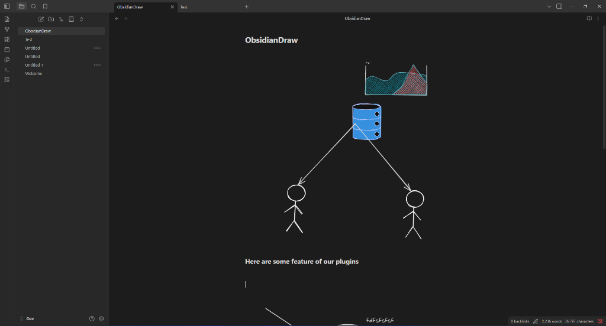
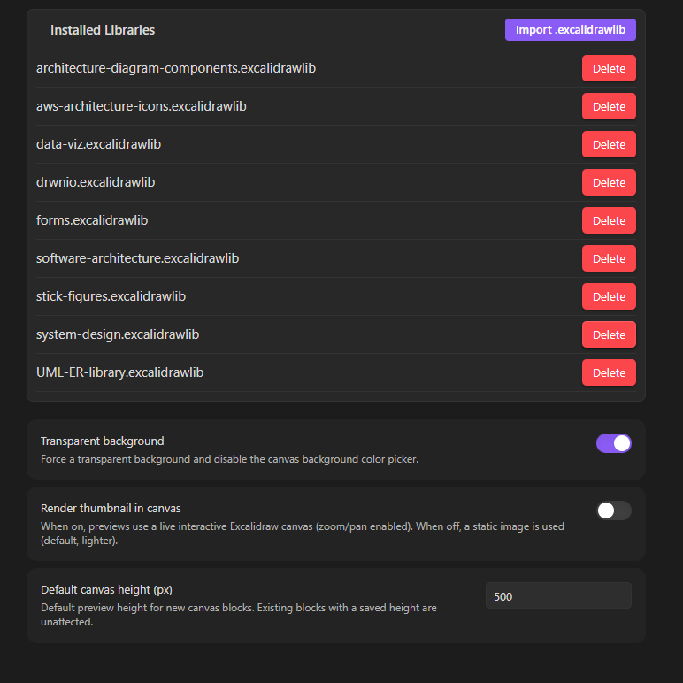

<div align="center">

# 🎨 CanvasDraw

**Seamless, lightweight, and powerful Excalidraw integration for Obsidian.**

Embed interactive drawings, system architecture diagrams, mind maps, and sketches directly inside your markdown notes with zero friction.

[](https://obsidian.md)
[](https://www.typescriptlang.org/)
[](https://excalidraw.com)
[](https://opensource.org/licenses/MIT)

<br/>



</div>

---

## ✨ Features at a Glance

- 📝 **Native Markdown Code Blocks** — Diagrams are stored directly within ` ```excalidraw ` code blocks in your note files.
- ⚡ **Instant Click-to-Edit Modal** — Click any drawing thumbnail to open the full-screen Excalidraw editor modal.
- 🖼️ **Image & Asset Support** — Paste or drag screenshots and images into your drawing; binary assets are automatically stored locally in your vault's `content/` folder without cluttering markdown.
- 📚 **Excalidraw Libraries & Custom Imports** — Full support to import `.excalidrawlib` files via the Library panel.
- 🔍 **Interactive Canvas & Zoom Controls** — Hover to reveal smooth `+` / `−` zoom buttons and a corner resize handle.
- 💾 **Per-Block Layout Persistence** — Canvas height and zoom level are saved directly inside each block's JSON metadata, preserving your exact viewport per drawing.
- 🌗 **Automatic Theme Sync** — Seamlessly adapts to Obsidian's Light and Dark themes.
- 🪟 **Transparent Background Mode** — Optional setting to render diagrams transparently for seamless note blending.
- ⌨️ **Command Palette Integration** — Fast commands to insert, edit, clear, and delete drawing blocks.

---

## 📸 Feature Tour

### 1. Inline Reading View Preview
In Reading View, your drawings render as crisp inline previews. Hover over any canvas to reveal interactive controls:
- **Click to open drawing editor** — launches the full Excalidraw modal
- **Zoom Controls (`+` / `−`)** — zoom in or out without opening the editor
- **Corner Resize Handle** — drag to adjust the preview height


---

### 2. Full-Featured Drawing Editor
Open any canvas into the complete Excalidraw workspace. Use shapes, arrows, custom colors, roughness settings, and handwriting fonts.


---

### 3. Library Panel & Element Browser
Click the **Library** button in the editor to open the side panel. Browse and drag pre-built elements directly onto your canvas, or click **Browse libraries** to discover more from the Excalidraw community.


---

### 4. Command Palette Quick Actions
Access all drawing actions instantly via `Ctrl+P` / `Cmd+P`:


| Command | Description |
| :--- | :--- |
| **CanvasDraw: Add canvas at cursor** | Inserts a new Excalidraw block at the current cursor position. |
| **CanvasDraw: Open canvas under cursor in editor** | Opens the drawing under the cursor in the full-screen editor. |
| **CanvasDraw: Create new note with canvas** | Creates a new markdown note pre-populated with a canvas block. |
| **CanvasDraw: Clear canvas under cursor** | Resets the drawing under cursor to a blank canvas. |
| **CanvasDraw: Delete canvas block under cursor** | Removes the entire Excalidraw block under cursor from the note. |

---

### 5. Customization & Library Settings
Configure your drawing preferences in **Settings → Community plugins → CanvasDraw**:



- **Installed Libraries**: View active `.excalidrawlib` packages, import new library files, or delete unwanted ones.
- **Transparent Background**: Toggle transparent background mode for seamless note blending.
- **Render Thumbnail in Canvas**: Switch between static image previews and live interactive canvas containers.
- **Default Canvas Height**: Set the default initial height (px) for newly created drawing blocks.

---

## 🚀 Getting Started

### Creating a Drawing

1. Open any note in Obsidian.
2. Run **`CanvasDraw: Add canvas at cursor`** from the command palette (`Ctrl+P` / `Cmd+P`), or insert a code block manually:
   ````markdown
   ```excalidraw
   {
     "elements": []
   }
   ```
   ````
3. Click the canvas thumbnail to open the Excalidraw editor and start sketching!
4. Close the modal when finished — your changes save automatically back to the note.

---

## 📦 Manual Installation

1. Download `main.js`, `manifest.json`, and `styles.css` from the [latest release](https://github.com/Raushan-kumar-yadav/obsidianDraw/releases/latest).
2. In your Obsidian vault, navigate to `.obsidian/plugins/` and create a folder named `canvas-draw`.
3. Copy the three files into `.obsidian/plugins/canvas-draw/`.
4. Open **Settings → Community plugins** in Obsidian, click Refresh, and enable **CanvasDraw**.

---

## 🛠️ Development

```bash
# Clone the repository
git clone https://github.com/Raushan-kumar-yadav/obsidianDraw.git

# Install dependencies
npm install

# Start development build (watch mode)
npm run dev

# Build production bundle
npm run build
```

---

## 📄 License

This project is licensed under the [MIT License](LICENSE).